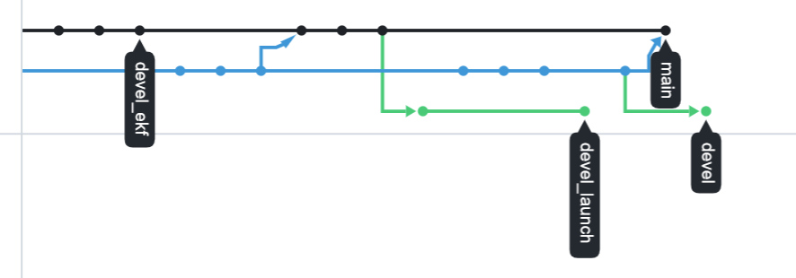
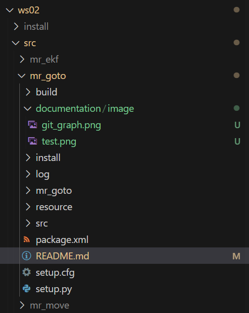
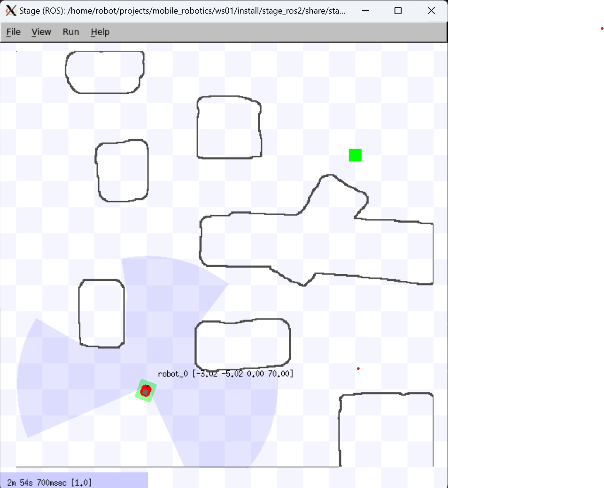
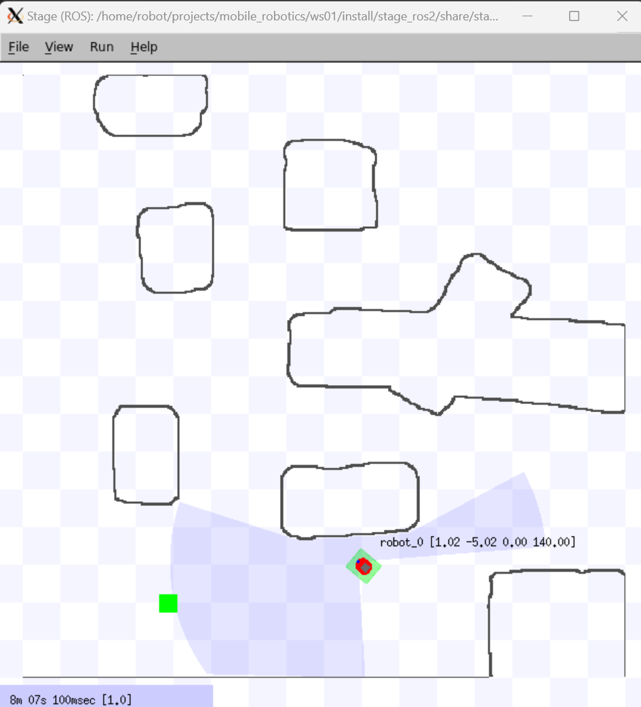
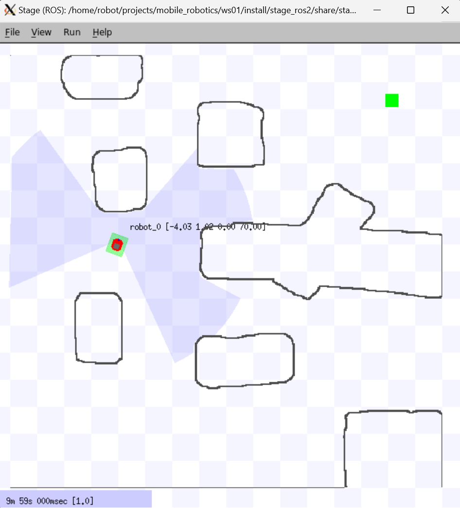
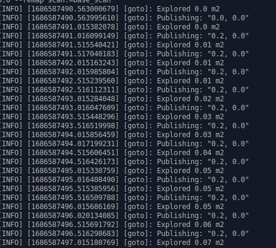
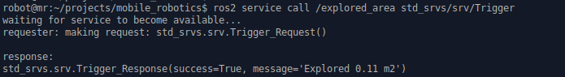
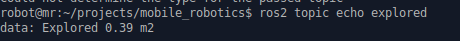

# mr_goto

## Usage
---
### Launch Map
ros2 launch stage_ros2 stage.launch.py

### Start GoTo
ros2 run mr_goto goto --ros-args -p mode:="plan" -p x:=-3.0 -p y:=-5.0 -p deg:=70.0 --remap scan:=base_scan

### Call explored Area Service
ros2 service call /explored_area std_srvs/srv/Trigger

---
## Installation
make build-ws02\
restart terminal

---
## Documentation
### 0 Documentation
#### 0.1 Points
|Task|Points|Author|
|---|---|---|
|0.|100%|All|
|0.2|20|All|
|1.0.1|20|Rita Schrabauer|
|1.1|50|Florian Wimmer|
|1.2.1|25|Simon Roth|
|1.2.2|25|Florian Wimmer|
|1.3.1|25|Simon Roth|
|1.3.2|25|Simon Roth|
|5.1|20|Rita Schrabauer|
|5.2|20|Rita Schrabauer|
|5.3|20|Rita Schrabauer|
|5.4|20|Rita Schrabauer|
|6|50|Rita Schrabauer, Florian Wimmer|
|7.1|30|Simon Roth|
|7.2|20|Simon Roth|
|7.3|10|Simon Roth|
|**Sum**|**380**|**All**|

|Authors|Points(%)|
|---|---|
|Simon Roth|33.3|
|Rita Schrabauer|33.3|
|Florian Wimmer|33.3|


#### 0.2. Git usage
Git was used during the project.



### 1 GoTo
#### 1.0.1 Self Localization 
Documentation Missing
#### 1.1 New 
The GoTo Task was implemented in a new Python Node.



#### 1.2 Simple, no Obstacle
To accomplish the simple goto exercise, the map was divided into grid cells of equal size. These cells all stored the cost (distance) to the cell containing the goal point. The robot navigation was executed with a simple greedy selection for the cell with the lowest distance of all the cells neighbouring the robots current position.


Used Command:
```
ros2 run mr_goto goto --ros-args -p mode:="plan" -p x:=-3.0 -p y:=-5.0 -p deg:=70.0 --remap scan:=base_scan
```
Result for just the simple navigation:


Result with pose:




#### 1.3 Avoid Obstacle
#### 1.3.1 Box
Used Command:
In order to accomplish this, the greedy selection from the last exercise was enhanced. The robot is discouraged from moving to close or turning towards obstacles, while it is encouraged to keep driving straight when near an obstacle. While this does not guarantee a shortest/optimal path, it works rather well.
```
ros2 run mr_goto goto --ros-args -p mode:="plan" -p x:=1.0 -p y:=-5.0 -p deg:=70.0 --remap scan:=base_scan
```
Result:



#### 1.3.2 Cave

The cave uses the same algorithm as the 1.3.1 assignment.

Used Command:
```
ros2 run mr_goto goto --ros-args -p mode:="plan" -p x:=-4.0 -p y:=1.0 -p deg:=70.0 --remap scan:=base_scan
```
Result:



### 5. Launch File
#### 5.1 Basic Launch
#### 5.2 Optional EKF or PF
#### 5.3 Prameter File
#### 5.4 Relative Path for Parameter File

### 6. Network (DDS-Security)
The needed commands for installing the sros2 package are:
```
sudo apt update
sudo apt install libssl-dev
colcon build --symlink-install --cmake-args -DSECURITY=ON
```

Then the keystore has to be generated:
```
ros2 security create_keystore <keystore name>
```
In this project the keystore is in the sros2 directory and called keystore.

The keys and certificates are created for each node.
```
ros2 security create_enclave <keystore name> <node name>
```

For the nodes to use the encryption the param ```--enclave <node name>``` is needed. Also three environment variables need to be set:
```
export ROS_SECURITY_KEYSTORE=<keystore name>
export ROS_SECURITY_ENABLE=true
export ROS_SECURITY_STRATEGY=Enforce
```
For this env_vars.sh has to be sourced.
### 7. Exploration
#### 7.1 Calculate explored area
Every cell the robot passes through for the first time has it's area in square meters added to the total explored area, which is printed to the console every cycle.

Result:



#### 7.2 Service Call

The service is implemented in the goto.py file. The command to check it is:

```
ros2 service call /explored_area std_srvs/srv/Trigger
```
Result:



#### 7.3 Topic

The explored are is published on the explored topic. Checking this topic while the robot is running gives the current explored area:




